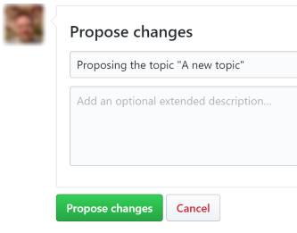
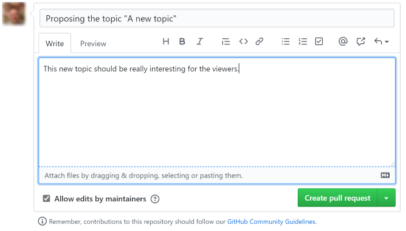

# Contributing a synopsis for a new topic

This document explains how you can contribute a new topic to the Microsoft Glossary. Thank you for your interest in helping us grow this glossary!!

The first step in submitting a new topic is to create a synopsis with all the relevant information. When the synopsis is finished and submitted, we will review it and contact you to talk about recording the video and adding the new topic to the website.

## Browse the site and get familiar with the format

As a first step, you should browse [the Microsoft Glossary website](http://gslb.ch/gloss) and watch some of the videos. We are trying to get a unified experience and if possible the topics on the site should have a similar format.

This is also a chance to check if the topic that you have in mind already exists! If that is the case and you think the topic should be modified or updated, [contact us](mailto:lbugnion@microsoft.com)!

## Submit the new topic

[Go to the Microsoft Form available here](http://gslb.ch/gloss-form-new).

Enter the following information:

- Your name.
- Your Twitter name (this is optional).
- The new topic, for example `App Service`.
- A short description explaining what the new topic stands for.

This information will be very useful to us to understand what the new topic is about, and how the publication will continue.

## Get an email

After the submission, you will receive a new email (at the email address with which you logged into the Microsoft Form site).

If everything went well during the submission, the email will have information for the next steps (see below).

> If something went wrong during the submission, for example if you tried to submit a topic that already exists, all your information is saved and we will get notified. In that case, we will contact you for discussions.

The "success" email has the following information:

- A summary of your submission.
- A link to this document.
- A link to the new topic that you just submitted [in the GitHub repository](https://github.com/lbugnion/ms-glossary).

> The document created by your submission in the Microsoft Glossary repository is called a `synopsis`. This is the document in which you will be working in the next steps to finalize your submission.

## Check the synopsis

Your next step is to work on the synopsis to complete your submission. Navigate to the link from the email you received. This link should be something like this:

`https://github.com/lbugnion/ms-glossary/blob/app-service/synopsis/app-service.md`

> Of course your link will be slightly different based on the topic you submitted.

This link is into a new branch inside the GitHub repository. This allows you to work without risking to cause issues inside the repository. This is important because the repository's content is used to automatically update the Microsoft Glossary website.

The GitHub page should look something like this:

The following points must be noted:

1. This is the name of the synopsis document, which corresponds to the new topic you submitted.

2. Some of the synopsis has been automatically updated based on your submission, but there is more work to do.

3. This new synopsis is into a branch. It means that your changes will be into a kind of sandbox and won't affect the rest of the site until you are ready to submit.

> [More information about GitHub branches](https://help.github.com/en/github/collaborating-with-issues-and-pull-requests/about-branches).

4. In order to make changes to the document, you will click on the Edit button here. Note that the button will be disabled if you are not logged into GitHub.

To continue with the next steps, you will need a GitHub account. This is not the same as your Microsoft account. If you don't have one already, [you can create a new GitHub account with these instructions](https://help.github.com/en/github/getting-started-with-github/signing-up-for-github).

## Edit the synopsis

> Use this to edit directly into your web browser easily.

> For advanced GitHub users: you can also fork and clone the repo locally, make your edits in your favorite markdown editor, and then submit a pull request to the main repo.

After logging into GitHub, press the Edit button (#4 on the image above).

This will open the editor page, in which you can edit the Markdown document.

> [More information about Markdown can be found here](https://www.markdownguide.org/).

The synopsis document has additional instructions showing what information we are looking for.

Once your are done editing, follow the instructions below to submit a pull request.

## Submit a pull request

When you are satisfied with your synopsis, you can submit it with the following steps.

- Scroll down to the bottom of the page.
- Enter a comment for the proposed change.
- Press the `Propose changes` button.

- In the next window, you will see the differences between the original document and your changes.
- If you are still satisfied, press the `Create pull request` button.

- Enter a comment about your changes and then press the `Create pull request` button again.

- You should now see a confirmation page.

That's it, you have contributed your synopsis!! We will review your proposal and contact you to coordinate the next steps.
